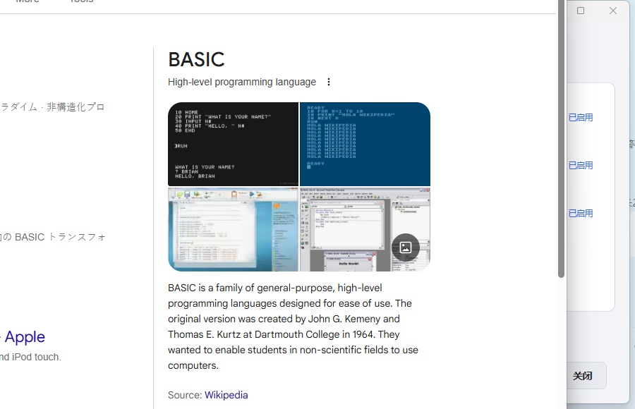

# MailPulse 📩

托盘常驻的邮件验证码监控工具 —— 收到验证码 / 确认链接邮件时即时弹出悬浮通知，一键复制验证码、打开链接。

基于 **.NET Framework 4.8**（WPF + WinForms 托盘），Windows 10/11 开箱即用。

## 📸 截图

| 浅色主界面 | 深色主界面 |
|---|---|
|  |  |

| 账号编辑 | 规则编辑器 | LLM 设置 | LLM 配置 | 验证码通知 |
|---|---|---|---|---|
|  |  |  |  |  |

## ✨ 功能特性

- **托盘后台常驻**：无主窗口打扰，关闭主界面后继续运行；可选开机自启
- **多协议收信**：IMAP（IDLE 实时推送）/ POP3（轮询），内置 Gmail / QQ / Outlook 预设
- **微软账号 OAuth2**：支持 @outlook.com / @live.com / @live.cn / @hotmail.com（设备码授权，token 自动刷新）
- **规则引擎**：主题关键词 或 正文正则，任一命中即触发；正则可提取验证码 / 确认链接；支持发件人白名单
- **LLM 智能兜底**：本地规则未命中时，调用大模型判断并提取（支持 OpenAI Chat、OpenAI Responses、Anthropic 三种协议，可多配置、自定义提示词）
- **悬浮通知**：圆角卡片 + 滑入动画 + 30 秒倒计时条；一键复制验证码、打开链接；点击后自动标记邮件已读（IMAP）
- **去重防打扰**：提醒过的邮件持久化记录，重启后不重复提醒
- **深浅色主题**：设置内一键切换，全局生效
- **安全**：邮箱密码 / API Key 均使用 Windows DPAPI 加密存储

## 🚀 快速开始

### 运行

发布产物为单文件（依赖已内嵌）：

1. 从 [Releases](../../releases) 下载 `MailPulse.exe`（或自行构建）
2. 双击运行，首次启动自动打开主界面
3. 添加邮箱账号（选预设 → 填邮箱与密码/授权码 → 测试连接）
4. 等待验证码邮件，右下角自动弹出通知

> 配置文件位于 `%AppData%\MailPulse\config.json`，日志位于 `%AppData%\MailPulse\logs\`

### 构建

需要 [.NET SDK](https://dotnet.microsoft.com/download)（含 .NET Framework 4.8 Developer Pack）：

```bash
dotnet build MailPulse.csproj -c Release
```

输出：`bin\Release\net48\MailPulse.exe`（单文件，含 Costura 内嵌依赖）

## 📧 各邮箱接入说明

| 邮箱 | 协议 | 说明 |
|------|------|------|
| Gmail | IMAP | 需开启两步验证并生成**应用专用密码** |
| QQ 邮箱 | IMAP | 网页端开启 IMAP 并生成**授权码**（非 QQ 密码）|
| Outlook / Live | IMAP | 微软已禁用密码直连，请使用对话框内的 **OAuth 授权**按钮 |

## 🤖 LLM 兜底配置

1. 主界面 → **LLM 设置**
2. 添加配置：选择协议（OpenAI Chat / OpenAI Responses / Anthropic）、填写 Base URL、API Key、模型
3. 点击 **测试选中** 验证连通性
4. 勾选 **启用 LLM 兜底**，可自定义提示词（支持 `{subject}` / `{body}` 占位符）

兼容 OpenAI 格式的第三方服务（DeepSeek、通义、Ollama 等）只需修改 Base URL 与模型名。

## 🎨 主题

主界面 → 底部「外观」下拉框，支持浅色 / 深色切换，选择即时生效并持久化。

## 🔒 隐私说明

- 凭据仅通过 DPAPI 加密保存在本机 `%AppData%\MailPulse\config.json`
- 提醒历史记录在本地 `seen.json`，不上传任何数据
- 邮件正文仅在需要 LLM 兜底判断时发送至您配置的模型服务

## 📄 License

[MIT](LICENSE)
