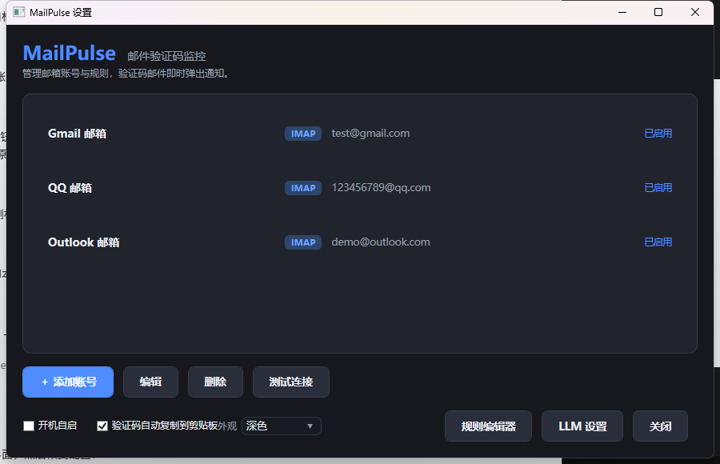
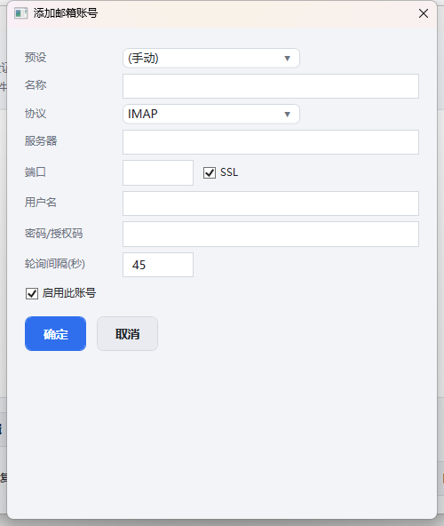
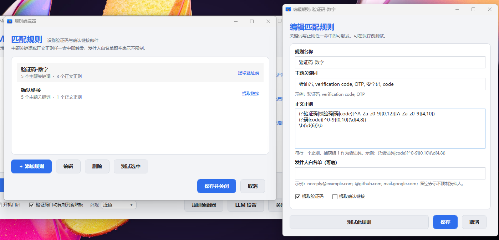
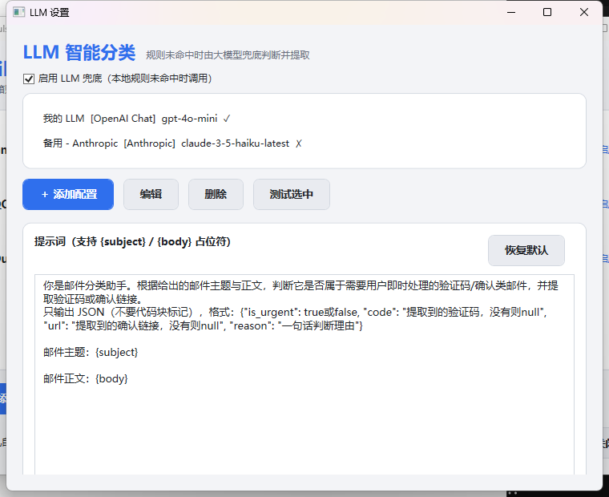
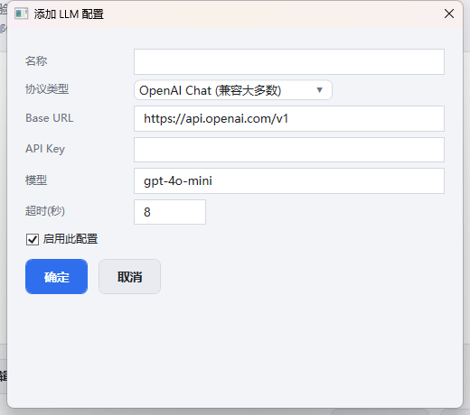
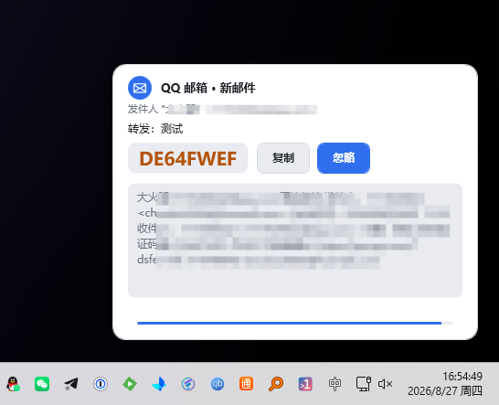

# MailPulse 📩

托盘常驻的邮件验证码监控工具 —— 收到验证码 / 确认链接邮件时即时弹出悬浮通知，一键复制验证码、打开链接；内置轻量邮件中心，可查看、回复和发送邮件。

微软邮箱推荐使用自有 Entra 公共客户端应用 + Microsoft Graph，可统一完成读取、监控、标为已读、删除和发送。程序只保存 DPAPI 加密的 refresh token，不需要也不会保存客户端密钥。旧版微软第一方“快速登录”曾可正常读取，且已有 refresh token 可能继续有效；但当前重新授权可能因预授权策略返回 `invalid_request`，因此不再建议作为唯一方案。

基于 **.NET Framework 4.8**（WPF + WinForms 托盘），Windows 10/11 开箱即用。

## 📸 截图

| 浅色主界面 | 深色主界面                                   |
| ---------- | -------------------------------------------- |
| .          |  |

| 账号编辑                                              | 规则编辑器                                        | LLM 设置                                        | LLM 配置                                                | 验证码通知                                 |
| ----------------------------------------------------- | ------------------------------------------------- | ----------------------------------------------- | ------------------------------------------------------- | ------------------------------------------ |
|  |  |  |  |  |

## ✨ 功能特性

- **托盘后台常驻**：无主窗口打扰，关闭主界面后继续运行；可选开机自启
- **多协议收信**：IMAP（IDLE 实时推送）/ POP3（轮询），内置 Gmail / QQ / Outlook 预设
- **微软账号 OAuth2**：支持 @outlook.com / @live.com / @live.cn / @hotmail.com（设备码授权，token 自动刷新）
- **规则引擎**：主题关键词 或 正文正则，任一命中即触发；正则可提取验证码 / 确认链接；支持发件人白名单
- **LLM 智能兜底**：本地规则未命中时，调用大模型判断并提取（支持 OpenAI Chat、OpenAI Responses、Anthropic 三种协议，可多配置、自定义提示词）
- **邮件翻译**：邮件中心一键将主题与正文翻译为简体中文，复用现有 LLM 配置，支持原文/译文切换及取消翻译
- **悬浮通知**：圆角卡片 + 滑入动画 + 30 秒倒计时条；一键复制验证码、打开链接；点击后自动标记邮件已读（IMAP）
- **去重防打扰**：提醒过的邮件持久化记录，重启后不重复提醒
- **深浅色主题**：设置内一键切换，全局生效
- **安全**：邮箱密码 / API Key 均使用 Windows DPAPI 加密存储

## 🚀 快速开始

### 运行

发布产物为单文件（依赖已内嵌）：

1. 从 [Releases](../../releases) 下载 `MailPulse.exe`（或自行构建）
2. 双击运行，首次启动自动打开主界面
3. 添加邮箱账号（选预设 → 填邮箱与密码/授权码 → 测试连接）
4. 等待验证码邮件，右下角自动弹出通知

> 配置文件位于 `%AppData%\MailPulse\config.json`，日志位于 `%AppData%\MailPulse\logs\`

### 构建

需要 [.NET SDK](https://dotnet.microsoft.com/download)（含 .NET Framework 4.8 Developer Pack）：

```bash
dotnet build MailPulse.csproj -c Release
```

输出：`bin\Release\net48\MailPulse.exe`（单文件，含 Costura 内嵌依赖）

## 📧 各邮箱接入说明

| 邮箱           | 协议 | 说明                                                    |
| -------------- | ---- | ------------------------------------------------------- |
| Gmail          | IMAP | 需开启两步验证并生成**应用专用密码**                    |
| QQ 邮箱        | IMAP | 网页端开启 IMAP 并生成**授权码**（非 QQ 密码）          |
| Outlook / Live | Microsoft Graph | 使用自有 Entra 公共客户端，添加 `Mail.ReadWrite`、`Mail.Send` 委托权限后完成 OAuth 授权 |

### Outlook / Live 快速配置

1. 在 Microsoft Entra 管理中心注册应用，帐户类型选择包含“个人 Microsoft 帐户”的选项
2. 进入“身份验证”→“高级设置”，将 **允许公共客户端流**设为“是”
3. 进入“API 权限”→ Microsoft Graph →“委托的权限”，添加 `Mail.ReadWrite` 和 `Mail.Send`
4. MailPulse 中编辑 Outlook 账号，选择“自有 Entra + Microsoft Graph（读取和发送）”
5. 填写“应用程序（客户端）ID”，点击 OAuth 登录，前往设备登录页面输入代码
6. 保存后点击“测试连接”；邮件中心的读取、正文、已读、删除、回复和发送都会自动走 Graph

> 设备码流程本身仍然可用。旧版本借用的微软 Office 第一方客户端 ID 在历史版本以及本轮排障早期曾正常工作，但当前对同一账号重新发起最小 IMAP 权限授权时，会因未预授权返回 `invalid_request`。这不代表微软已全局永久关闭该方案，只说明新授权的可用性不可控；已有 refresh token 与新 consent 的结果也可能不同。使用自己注册并启用公共客户端流的 Entra 应用可稳定完成设备码登录。

## 🤖 LLM 兜底配置

1. 主界面 → **LLM 设置**
2. 添加配置：选择协议（OpenAI Chat / OpenAI Responses / Anthropic）、填写 Base URL、API Key、模型
3. 点击 **测试选中** 验证连通性
4. 勾选 **启用 LLM 兜底**，可自定义提示词（支持 `{subject}` / `{body}` 占位符）

兼容 OpenAI 格式的第三方服务（DeepSeek、通义、Ollama 等）只需修改 Base URL 与模型名。

### 邮件翻译

在邮件中心打开邮件，正文加载完成后点击 **翻译为中文**。使用第一个已启用且填写了模型/API Key 的配置，无需勾选“启用 LLM 兜底”。

长邮件自动分段翻译，显示已完成段数和等待时间；每段独立等待至少 120 秒，不影响验证码提取的超时设置。翻译时可继续阅读原文或点击“取消翻译”；失败或取消后点击翻译按钮重试，会复用已完成的段落。

完成后用“查看原文 / 查看译文”切换，同一封邮件内切换不重复请求。译文为纯文本，图片和原始 HTML 排版保留在原文中。回复和验证码提取仍使用原邮件。

译文只在当前邮件预览期间临时保存，切换邮件或刷新后清除。超过 24,000 字符的邮件会提示暂不支持，不会静默截断。

## 🎨 主题

主界面 → 底部「外观」下拉框，支持浅色 / 深色切换，选择即时生效并持久化。

## 🔒 隐私说明

- 凭据仅通过 DPAPI 加密保存在本机 `%AppData%\MailPulse\config.json`
- 提醒历史记录在本地 `seen.json`，不上传任何数据
- 邮件主题与文本正文仅在需要 LLM 兜底判断或主动点击翻译时发送至您配置的模型服务；翻译不发送附件和图片

## 📄 License

[MIT](LICENSE)
